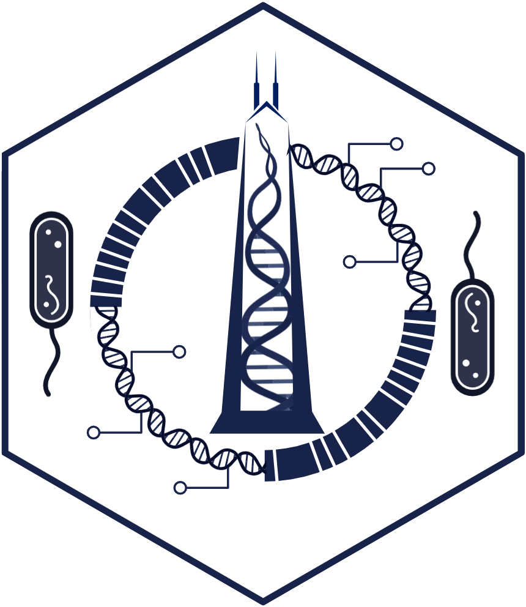
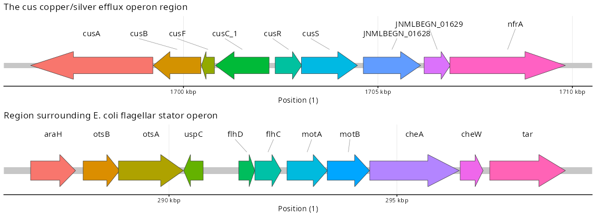
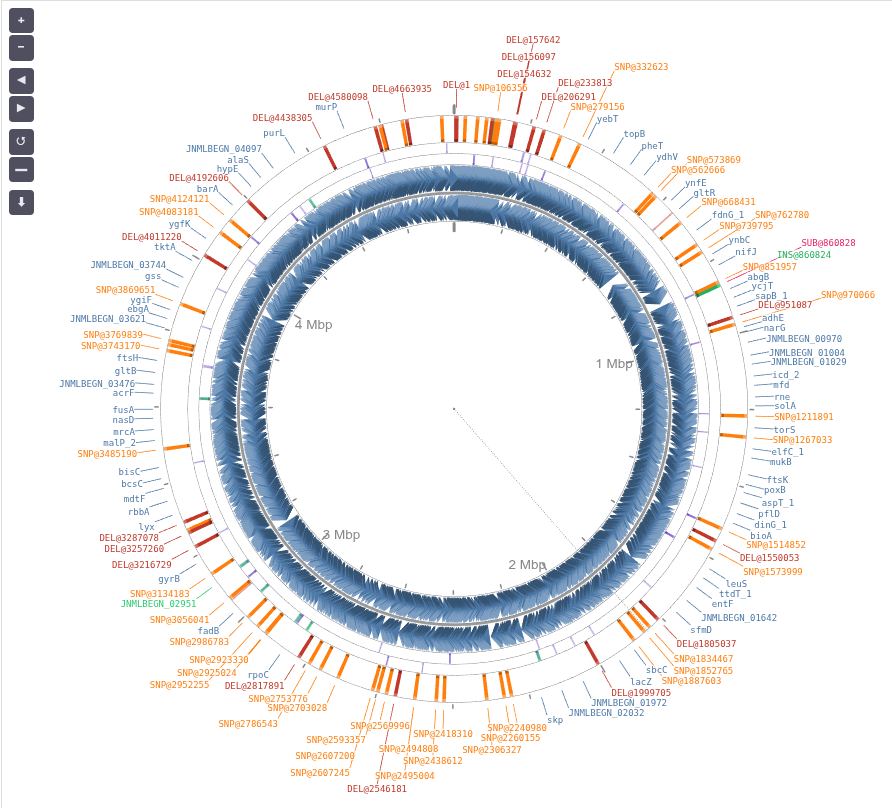

# micRomicon: An Ostensibly Format-Agnostic Microbial Genomics Toolkit for R


This is the repo for `micromicon`, a clean-architecture, low-cognitive-overhead toolkit for reading, representing, and examining microbial genomes in R. Whether working with reference genomes (GenBank, GFF3+FASTA) or genomic variance data (breseq `annotated.gd` files), `micromicon` provides a unified interface for genome navigation and variation analysis. 

This library is intended for use with haploid microbial genomic data (~5-20 Mbp).

The package supports two complementary modes: 

* **Genome Navigation Mode** (based around the `genome_entity` object) for reference sequence exploration.

* **Variation Analysis Mode** (based around the `genome_entity_gd` object) for tracking and analyzing genomic alterations derived from resequencing data processed using the [breseq pipeline](https://barricklab.org/twiki/bin/view/Lab/ToolsBacterialGenomeResequencing).

[<a href="https://doi.org/10.5281/zenodo.18665300"></a>](https://zenodo.org/badge/DOI/10.5281/zenodo.18665300.svg)

<br clear="both"/>

## Why micRomicon?

We wanted a free, open-source toolkit that worked naturally for R users and lowered the barrier of moving among file formats commonly used in microbial genomics. GenBank, GFF3+FASTA, and variation/mutation-oriented outputs each bring their own structural hurdles, and the parsing logic for these is often scattered across different packages and domains. After years of doing this the old way, we wanted a dedicated system to do the parsing and formatting for us, so that we could reroute cognitive bandwidth toward doing the actual science. 

`micromicon` ingests and consolidates common genomics file formats into stable representations (`genome_entity`, `genome_entity_gd`) so that import, storage, query, and export operations follow the same patterns regardless of where the data originated. What began as a collection of convenience wrappers has grown into a foundation for routine bacterial genomics analysis, with space intentionally reserved for future tooling, including expanded variant-aware workflows and functional consequence interpretation.

## Installation

```r
# Install from GitHub
if (!require(devtools)) install.packages("devtools")
devtools::install_github("RENAISSANCE-UIC/micromicon")

# Or, if the docs get borked try this:
if (!require(devtools)) install.packages("pak")
pak::pkg_install("RENAISSANCE-UIC/micromicon")

# Or from local source
devtools::install_local("/path/to/micromicon")
```

### Optional (But Strongly Recommended): Bioconductor Integration

For advanced features:

```r
if (!require("BiocManager", quietly = TRUE))
    install.packages("BiocManager")

BiocManager::install(c(
  "GenomicRanges",
  "Biostrings",
  "rtracklayer",
  "Rsamtools",
  "GenomeInfoDb",
  "S4Vectors",
  "IRanges"
))
```

## Two Complementary Modes

`micromicon` supports *two complementary modes* that share a common reference backbone but diverge in purpose:

### Genome Navigation Mode

##### NOTE: Visualization interfaces are in active development 

Built on the `genome_entity` S3 object, intended for reference navigation: sequences, features, metadata, and indices. Here, the user can browse the microbial genomic features, pull and inspect sequences, and mine the genomic complement in context. 

```r
library(micromicon)

# View micromicon functions
micromicon_functions()

# Read reference genome (GenBank or GFF3+FASTA)
entity <- read_genome(fasta = "reference.fasta", gff = "reference.gff3")
# or: entity <- read_genome("reference.gbk")

# Look at scaffold names (chromosomes, plasmids, contigs)
get_contig_names(entity)  # Get scaffold/contig/chromosome/plasmid names

# Inspect genome structure
get_genome_metadata(entity)  # View genome-level metadata

# Search and query features
search_features(entity)

# Filter specific features
ampC <- search_features(entity, pattern = "ampC", type = "CDS")
acrB <- search_features(entity, pattern = "acrB", type = "CDS")

# Extract sequences
protein <- get_gene_aa(entity, gene = "ampC")
dna <- get_gene_dna(entity, "acrB_1")

# Get features with flanking regions
get_feature_fasta(entity, "acrB_1",
                  flank_upstream = 5000,
                  flank_downstream = 2000)

# Extract regions of interest
get_roi_dna(entity, contig = "1", start = 1834322, end = 1837471)
get_roi_fasta(entity, contig = "1", start = 1834322, end = 1837471)

# Coordinate mapping (genomic ↔ CDS coordinates)
ds_pos <- map_genomic_to_cds(entity, gene = "dnaA", genomic_pos = 3176824)
genomic_pos <- map_cds_to_genomic(entity, gene = "dnaA", cds_pos = 3)

# Visualize a region of interest (**REQUIRES** ggplot2)
# Option 1: pass entity + gene name directly (flank defaults to 5000 bp)
plot_roi(entity, gene = "motA",
         arrow_height = 0.10,
         head_prop    = 0.35,
         neck_prop    = 0.60,
         label_size   = 5.2,
         title        = "Region surrounding the E. coli flagellar stator operon")

# Option 2: build the region table explicitly, then plot
roi <- get_roi_features(entity, contig = "1", start = 1977266, end = 1978197, flank = 5000)
plot_roi(roi,
         arrow_height = 0.10,
         head_prop    = 0.35,
         neck_prop    = 0.60,
         label_size   = 5.2,
         title        = "Region surrounding the E. coli flagellar stator operon")

# Integration with CGView.js
plot_cgview(entity, contig = "1")            # Launches in viewer
plot_cgview(entity, viewer = "browser")      # Launches in broswer

# BLAST proteins (PROVISIONAL, requires local database)
blast_protein(protein, database = "swissprot")
```

### Variation Analysis Mode

Implemented as `genome_entity_gd`, which inherits from the `genome_entity` object, this allows the reference to be supplemented with genomic variation events documented in the `annotated.gd` output from the [breseq pipeline](https://barricklab.org/twiki/bin/view/Lab/ToolsBacterialGenomeResequencing). 

By design, all legacy `genome_entity` functions operate unchanged on `genome_entity_gd`, but the converse is not true: `genome_entity_gd`-specific functions like `predict_variants()` require variant data.

```r
# Parse breseq output with reference genome
gd <- read_variants(entity, path = "annotated.gd")

class(gd) # [1] "genome_entity_gd" "genome_entity"   

# Summary of variants
summary(gd)

# All genome navigation functions work on gd objects
search_features(gd)
get_gene_aa(gd, gene = "ampC")
get_gene_dna(gd, "acrB_1")
get_roi_dna(gd, contig = "1", start = 1834322, end = 1837471)
get_roi_fasta(gd, contig = "1", start = 1834322, end = 1837471)
map_genomic_to_cds(gd, gene = "dnaA", genomic_pos = 3176824)
map_cds_to_genomic(gd, gene = "dnaA", cds_pos = 3)

# Variation-specific: predict variants (result cached on gd object)
gd <- predict_variants(gd)              # populates gd$variants_predicted
gd$variants_predicted             # access the table directly

# Enrich variants with molecular consequences
consequence_table <- annotate_variants(gd)
# Returns: DNA sequences (dna_ref, dna_alt), amino acid changes (aa_ref, aa_alt),
#          codon changes, and consequence classification
# Supports: SNP, DEL, INS, SUB variation types (coding and intergenic)
# Consequences: synonymous, missense, nonsense, frameshift, inframe_deletion, inframe_insertion
# Auto-detects OS: uses parallel processing on Linux/macOS, serial on Windows

# Filter on features of interest
filter_variants(consequence_table, min_freq = 0.9)
filter_variants(consequence_table, gene = "marR")
get_reference_dna(consequence_table, gene = "marR")

# Get reference or variant sequences from consequence table 
get_variant_dna(consequence_table, gene = "marR")
get_reference_aa(consequence_table, gene = "marR")
get_variant_aa(consequence_table, position = c(1834400, 1834500))
get_variant_aa(consequence_table, position = 1834467)

# Integration with CGView.js
plot_cgview(gd)
plot_cgview(gd, min_freq = 0.9)     # filter by gene frequency in a mixed population  
plot_cgview(gd, paired = TRUE, viewer = "browser")

```

### Format Conversion Rules

**IMPORTANT**: Format conversion in micromicon is intentionally one-way.

#### ALLOWED: GenBank → GFF3+FASTA
```r
genome <- read_genome("reference.gbk")     # Read GenBank
write_gff3(genome, "output.gff3")          # Export GFF3 ✓
write_fasta(genome, "output.fasta")        # Export FASTA ✓
```

Note: This conversion LOSES metadata.

#### FORBIDDEN: GFF3+FASTA → GenBank 
```r
genome <- read_genome(gff = "anno.gff3", fasta = "seq.fasta")
# write_genbank(genome, "output.gbk")  # DOES NOT EXIST - FORBIDDEN
```

**Why forbidden?**
- GenBank provides rich metadata (organism, taxonomy, references) that GFF3+FASTA lacks
- Converting GFF3+FASTA to GenBank would produce incomplete/invalid files
- No `write_genbank()` function exists (this is intentional, not a missing feature)

**GenBank metadata that GFF3+FASTA cannot represent**:
- Organism name and taxonomic lineage
- Publication references and citations
- Curator comments and assembly information
- Accession numbers and version history
- Database cross-references (taxonomy IDs, etc.)
- Sequence topology (circular vs. linear)

## Core Features

### (Ostensibly) Format-Agnostic Input

Read genomes (annotations and sequence data) from multiple formats into a unified representation:

```r
# GenBank (contains sequence data, annotation, and metadata)
genome1 <- read_genome("ecoli.gbk")

# GFF3 + FASTA (sequence and reference)
genome2 <- read_genome(gff = "ecoli.gff3", fasta = "ecoli.fna")

# All become genome_entity
class(genome1)  # "genome_entity"
class(genome2)  # "genome_entity"
```

### Search and Filter

Find features by type, name, or location:

```r
# All CDS features
cds <- get_features(genome, type = "CDS")

# Search by gene name
dna_genes <- search_features(genome, pattern = "dna")

# Features in a region
region <- search_features(genome,
  contig = "chr1",                 # <- look these up for your genome using get_contig_names(genome)
  start = 1000,
  end = 5000
)
```

### Extract Sequences

Pull sequences by coordinates or feature names using numerous accessors:

```r
# By coordinates
seqA <- extract_by_coords(genome, "chr1", 1000, 2000)
seqB <- get_roi_fasta(gd, contig = "chr1", start = 3000, end = 4000)

# By gene name
ampC_seq <- extract_by_name(genome, "ampC")
acrB_seq <- get_gene_dna(genome, "acrB")

# With translation
ampC_protein <- extract_by_name(genome, "ampC",
  type = "CDS",
  translate = TRUE
)
acrB_protein <- get_gene_aa(genome, gene = "acrB")

# Genomic regions with context
roi <- roi_coords("chr1", 1000, 2000, "+")
```

### Export to Standard Formats

Export genome data for downstream tools:

```r
# Read GenBank (preserves all metadata)
genome <- read_genome("reference.gbk")

# Export to GFF3+FASTA (for genome browsers, pipelines)
write_gff3(genome, "output.gff3")
write_fasta(genome, "output.fasta")
```

**METADATA LOSS**: Exporting from GenBank to GFF3+FASTA loses organism, taxonomy, references, and comments. Keep your original GenBank file.

**NO REVERSE CONVERSION**: There is no `write_genbank()` function. You cannot convert GFF3+FASTA back to GenBank format. This is unimplemented because GFF3+FASTA lacks required metadata.

```r
# FORBIDDEN - Will never be implemented:
# write_genbank(genome, "output.gbk")  # Does not exist
```

### Visualization

`plot_roi()` provides a static linear view of a genomic region of interest. Each feature is rendered as a directional arrow (direction of transcription), uniquely colored per gene, with automatic 2-D label collision avoidance. Note that currently this only pertains to regions of the reference genome, although we plan to introduce plotting of genomic variants in future updates.

`plot_roi()` can be called in two ways:

**Via `get_roi_features()` (explicit region):**

```r
roi <- get_roi_features(genome, contig = "chr1", start = 1971030, end = 1982387)
plot_roi(roi)

# Add a title
plot_roi(roi, title = "che/mot/fli operon")

# Custom colors for specific genes
plot_roi(roi, colors = c(cheA = "#E41A1C", motA = "#377EB8"))

# Returns a ggplot object -- extend as usual
plot_roi(roi) + ggplot2::theme(plot.title = ggplot2::element_text(face = "bold"))
```

**Directly on a `genome_entity` or `genome_entity_gd` object:**

```r
# Gene name mode: finds the gene automatically, flanks by 5000 bp by default
plot_roi(genome, gene = "motA")
plot_roi(genome, gene = "motA", flank = 10000)

# Coordinate mode: explicit region
plot_roi(genome, contig = "chr1", start = 1971030, end = 1982387)

# Works identically on genome_entity_gd (reference features are plotted)
plot_roi(gd, gene = "motA")
plot_roi(gd, contig = "chr1", start = 1971030, end = 1982387)

# All appearance options apply in both modes
plot_roi(genome, gene = "motA",
         flank        = 8000,
         title        = "Region surrounding motA",
         arrow_height = 0.10,
         head_prop    = 0.35,
         neck_prop    = 0.60,
         label_size   = 5.2,
         colors       = c(motA = "#377EB8"))
```
 

Circular genome visualization is powered by 'CGView.js', rendered as an interactive htmlwidget via `plot_cgview()`. Single-contig maps display annotated features (CDS, tRNA, rRNA) color-coded by type. 

When working with a `genome_entity_gd object`, genomic differences can be overlaid on the reference map or shown as juxtaposed reference/variants panels (paired = TRUE). Plots open in the RStudio Viewer pane by default; pass viewer = "browser" to launch a full-width view in the system browser.

```r
plot_cgview(genome, contig = "1")
plot_cgview(genome, viewer = "browser")
```
 


### Local BLASTP Integration (PROVISIONAL)

Compare proteins against local databases:

```r
# Extract protein sequence
ampC <- search_features(genome, pattern = "ampC", type = "CDS")
protein <- ampC$translation

# BLASTP against local SwissProt
hits <- blast_protein(protein, database = "swissprot")

print(hits)
```

**Requirements**: Local BLAST+ and database. See [BLAST Setup Guide](BLAST_SETUP.md).

## Design Philosophy

### Clean Architecture

`micromicon` follows some Clean Architecture principles:

- **Entities**: `genome_entity` and `genome_entity_gd` as the core domain objects
- **Use Cases**: Pure functions for genome operations (business logic)
- **Controllers**: User-facing API surface
- **Generics**: S3 generic definitions and their method dispatch
- **Gateways**:  Integration surfaces to external formats, tools, or data sources
- **Frameworks**: Utility functions and adapters

This separation ensures:
- Object-scoped operations
- Easy testing and validation
- Extensibility for future formats
- No framework lock-in


### The Object System Roadmap (S3 → S4/S7)

In this initial release, we employ S3 objects as the primary interface for `genome_entity` and all derived and related operations. This was not (soley) from ideological allegiance, but from pragmatic concinnity: familiarity, low-friction extensibility, and excellent discoverability for most R users. At this stage of development, S3 provides a stalwart, easily inspectable substrate on which to stabilize the core idioms of `micromicon`.

As the codebase matures, we plan a gradatim migration toward more constrained and less mutable object systems, likely S4 or S7. Both provide stricter contracts, clearer invariants, and richer introspection, which will become increasingly important as the toolkit grows to support variant-aware workflows, functional consequence inference, and multi-genome comparative operations.
The precise destination remains open. S7, in particular, offers an appealing blend of rigor and simplicity (orthogonal to S4’s sometimes baroque formalism) while preserving the kind of explicitness that helps prevent accumulation of structural drift. Whatever the final form, the public interface will retain its present ethos: clean, predictable generics and minimal cognitive overhead for downstream analysis.

### S3 Generics for Extensibility

Core accessors use S3 dispatch, enabling custom implementations:

```r
# Built-in: in-memory genome
genome <- read_genome("ecoli.gbk")
get_features(genome)  # Returns data.frame

# Future: remote database genome
genome_remote <- connect_to_db(...)
get_features(genome_remote)  # Queries database, same interface
```

## Pipes, Routing, and Early Thinness

The public API of `micromicon` is intentionally thin. Most user-facing functions apply S3 generics that act as the routing stubs that inspect the object’s class and dispatch to a backend implementation. We kept some wrappers deliberately minimal for now to preserve architectural flexibility as the backend proliferates (in-memory objects today; remote stores or on-disk indices later). Think of it as preemptive debt-control. `micromicon` emerged from an earlier, more noodle-shaped prototype. Rather than retrofit dispatch and purity later, we wanted to scaffold in routing early, ensuring that method boundaries, side-effect hygiene, and extension points would be made explicit from the start.

We have borrowed the excellent design idioms familiar in other ecosystems (clean architecture, dependency inversion, strict boundaries between entities and gateways). While R itself does not enforce these constraints, we hope that the idioms will make the public interface predictable, the backends swappable, and the migration to stricter object systems (S4 or S7) straightforward as our invariants become more fully specified. 


## Documentation

- **Getting Started**: See the [vignette](vignettes/micromicon-intro.Rmd)
- **BLAST Setup**: [BLAST_SETUP.md](BLAST_SETUP.md)
- **Function Reference**: `?read_genome`, `?search_features`, etc.

## Extensibility

`micromicon` is designed to be extended through S3 subclassing.

### Subclassing Example: `genome_entity_gd`

The `genome_entity_gd` subclass demonstrates extensibility:

```r
# genome_entity_gd extends genome_entity with variation/mutation data
gd <- parse_gd_annotated("annotated.gd", entity)

class(gd)
# [1] "genome_entity_gd" "genome_entity"

# All base methods work (inheritance)
get_features(gd)           # Works
get_gene_aa(gd, "ampC")  # Works

# New methods for subclass
predict_variants(gd)  # gd-specific function
```

### Custom Genome Sources

You can implement your own subclasses:

```r
# Define a remote genome class
genome_entity_remote <- structure(
  list(connection = db_conn, cache = list()),
  class = c("genome_entity_remote", "genome_entity")
)

# Implement methods
get_features.genome_entity_remote <- function(x, ...) {
  query_database(x$connection, "SELECT * FROM features")
}

# Works seamlessly
get_features(remote_genome)  # Dispatches to your method
```

### Current Capabilities

`micromicon` currently supports:
- **Variant-aware workflows**: Track variants and mutations via `genome_entity_gd`
- **Visualization**: Integration with `CGView.js` via `plot_cgview()`
- **breseq integration**: Parse `annotated.gd` files using `read_variants()`
- **Variation analysis tables**: Generate predicted variant summaries with `predict_variants()`
- **Consequence enrichment**: Molecular impact analysis with `annotate_variants()` for SNP/DEL/INS/SUB
- **Cross-platform optimization**: Auto-detects OS for parallel (Linux/macOS) or serial (Windows) processing
- **Unified interface**: All navigation functions work on both modes

### Future Directions

Planned features:
- **Enhanced consequence analysis**: Protein domain mapping and functional impact scoring
- **Comparative genomics**: Multi-genome operations and phylogenetic integration
- **VCF support**: Import variant calls from other pipelines
- **Time-series analysis**: Track evolutionary dynamics across multiple samples
- **Visualization**: Remember [ApE](https://jorgensen.biology.utah.edu/wayned/ape/), A Plasmid Editor by Davis and Jorgensen? What if this, but for microbial genomics using modern tooling?

## Dependencies

**Required**:
- R ≥ 4.1.0
- cli, dplyr, readr, tibble

**Optional** (but recommended):
- Bioconductor packages (GenomicRanges, Biostrings, rtracklayer) for advanced features
- BLAST+ for local BLASTP

### Tested Versions

`micromicon` has been developed and tested with the following package versions:

**R and Bioconductor:**
- R: 4.5.0
- Bioconductor: 3.21

**Bioconductor Packages:**
- GenomicRanges: 1.62.1
- Biostrings: 2.78.0
- rtracklayer: 1.70.0
- Rsamtools: 2.26.0
- GenomeInfoDb: 1.46.2
- S4Vectors: 0.48.0
- IRanges: 2.44.0

**Note:** We have not tested `micromicon` with other versions of these packages. While the package may work with different versions, compatibility is not guaranteed. If you encounter issues with different package versions, please report them as GitHub issues.

## Contributing

We welcome contributions! Areas of interest:
- Additional format parsers (EMBL, PTT, etc.)
- Variant call integration (VCF, breseq)
- Functional annotation tools
- Performance optimizations

## Citation

If you use `micromicon` in your research, please cite:

```
Ackerman, W. (2026). micRomicon: An ostensibly format-agnostic microbial genomics toolkit for R. Zenodo. https://doi.org/10.5281/zenodo.18500345
```

## License

MIT License - see [LICENSE](LICENSE) file for details.

## Funding

The authors gratefully acknowledge support from the University of Illinois Chicago Institute for Health Data Science Research and from the *What If…* Awards for Creative Medical Research.

## Acknowledgments

`micromicon` builds on the shoulders of:
- [breseq](https://barricklab.org/twiki/bin/view/Lab/ToolsBacterialGenomeResequencing) — the wonderful (and for our group, definitive) computational pipeline for finding variants relative to a reference sequence in short-read DNA re-sequencing data, developed by the Barrick Lab 
- Bioconductor ecosystem (GenomicRanges, Biostrings, rtracklayer)
- NCBI BLAST+ toolkit
- Clean Architecture principles by Robert C. Martin ("Uncle Bob")
- [CGView.js](https://js.cgview.ca/index.html) — the interactive circular genome viewer powering `plot_cgview()`, developed by Paul Stothard and the CGView team

---

**Questions?** Open an [issue](https://github.com/RENAISSANCE-UIC/micromicon/issues) or check the [vignette](vignettes/micromicon-intro.Rmd).
